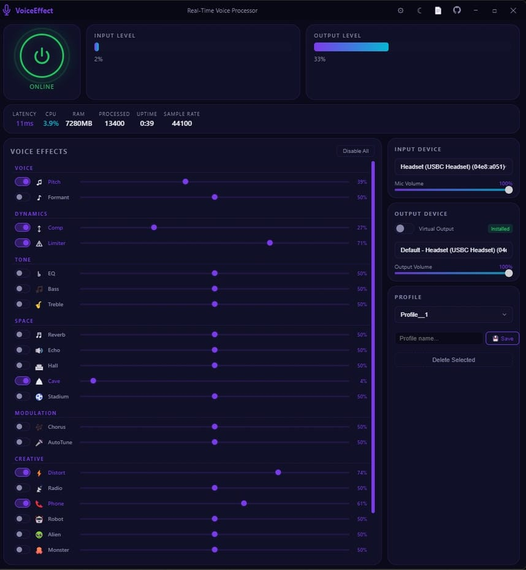

# VoiceEffect

Real-time voice effect processor for Windows. Change your voice with 22 built-in effects, save presets, and route audio through virtual devices.



## Download

| Version | Download |
|---------|----------|
| Installer | [VoiceEffect Setup 1.0.0.exe](https://github.com/eaeoz/VoiceEffect/releases/download/1.0.0/VoiceEffect.Setup.1.0.0.exe) |
| Portable | [VoiceEffect_portable_1.0.0.exe](https://github.com/eaeoz/VoiceEffect/releases/download/1.0.0/VoiceEffect_portable_1.0.0.exe) |

- **Installer** — Installs like a regular program. You can choose the install directory.
- **Portable** — Runs without installation. Just double-click the `.exe` file.

Both versions work on **Windows 10/11 (64-bit)**.

## Quick Start

1. Download and run VoiceEffect (installer or portable).
2. Allow microphone access when prompted.
3. Select your microphone from the **Input Device** dropdown.
4. Select your speakers or headphones from the **Output Device** dropdown.
5. Click **Start** to begin processing.
6. Enable any effect using the toggle switch and adjust intensity with the slider.

You can hear your processed voice in real time through your speakers or headphones.

## Features

- 22 built-in voice effects with on/off toggles and intensity sliders (0-100%)
- Presets system — save, load, and delete effect combinations
- Input/output device selection
- Per-device volume control
- Virtual audio adapter (VB-Cable) support with auto-install
- Dark/Light theme toggle
- System tray minimize with close-to-tray option
- Live input/output level meters with adjustable sensitivity
- CPU, RAM, latency, and uptime stats display
- Window position/size persistence across restarts
- Auto-start audio on launch option
- Profile backup and restore

## Effects

| Group | Effects |
|-------|---------|
| Voice | Pitch, Formant |
| Dynamics | Compressor, Limiter |
| Tone | EQ, Bass Boost, Treble Boost |
| Space | Reverb, Echo, Hall, Cave, Stadium |
| Modulation | Chorus, AutoTune |
| Creative | Distortion, Radio, Telephone, Robot, Alien, Monster, Child, Deep, Chipmunk |

### What Each Effect Does

- **Pitch** — Raise or lower your voice pitch.
- **Formant** — Shift vocal character without changing pitch (makes voice sound thicker or thinner).
- **Compressor** — Evens out volume levels for a more consistent sound.
- **Limiter** — Prevents audio from exceeding a set loudness.
- **EQ** — Adjust overall tone balance (brightness vs warmth).
- **Bass Boost** — Enhances low frequencies for a deeper sound.
- **Treble Boost** — Enhances high frequencies for a crisper sound.
- **Reverb** — Adds room-like echo reflections.
- **Echo** — Repeats your voice with a delay.
- **Hall, Cave, Stadium** — Larger reverb environments with different characteristics.
- **Chorus** — Makes your voice sound like multiple voices.
- **AutoTune** — Snap your voice to the nearest musical note.
- **Distortion** — Adds a gritty, overdriven sound.
- **Radio** — Simulates AM/radio bandwidth-limited audio.
- **Telephone** — Simulates a phone call audio effect.
- **Robot** — Metallic, monotone robotic voice.
- **Alien** — Sci-fi style vocal effect.
- **Monster** — Deep, menacing voice.
- **Child** — Simulates a child's voice.
- **Deep** — Extra low voice effect.
- **Chipmunk** — High-pitched, fast-sounding voice.

## Presets

Presets let you save your current effect settings and reload them later. Open the **Side Panel** to:

- **Save** — Create a new preset from your current settings.
- **Load** — Apply a saved preset.
- **Delete** — Remove a preset you no longer need.
- **Backup / Restore** — Export all presets to a file or import from a backup.

Presets are stored as JSON files in the `presets/` folder.

## Virtual Audio Adapter (VB-Cable)

If you want to send your processed voice to other apps (Discord, Zoom, OBS, etc.), you can install the **VB-Audio Virtual Cable** directly from VoiceEffect:

1. Go to the **Side Panel** and find the Adapter section.
2. Click **Install** — the driver downloads and installs automatically.
3. Select **CABLE Input** as your output device in VoiceEffect.
4. In the target app (Discord, Zoom, etc.), select **CABLE Output** as the input device.

Your processed voice is now routed to that app.

## Settings

| Setting | Default | Description |
|---------|---------|-------------|
| Sample Rate | 44100 | Audio quality (22050 / 44100 / 48000) |
| Buffer Size | 256 | Lower = less latency but more CPU usage (128-2048) |
| Input/Output Volume | 80 | Mic and speaker volume (0-100) |
| Theme | Dark | Dark or Light |
| Auto-Start | Off | Start audio processing on launch |
| Minimize to Tray | On | Hide to system tray instead of closing |
| Input/Output Sensitivity | 300/100 | Level meter sensitivity (50-600) |

Settings are saved automatically and restored on next launch.

## Requirements

- Windows 10 or later (64-bit)
- Microphone
- Speakers or headphones
- (Optional) VB-Audio Virtual Cable for routing to other apps

---

## For Developers

### Install & Run

```bash
npm install
npm start
```

### Building

```bash
npm run build          # Portable + NSIS installer
npm run build:portable # Portable only
npm run build:setup    # NSIS installer only
```

Output goes to `dist/`. Windows x64 only.

### Architecture

```
main.js                     Electron main process (window, IPC, tray, settings, device enumeration)
preload.js                  Context bridge - exposes safe API to renderer
audio-engine.js             Main process audio state, device enumeration, stats aggregation
virtual-audio-adapter.js    VB-Cable driver installer/uninstaller
create-icon.js              Programmatic PNG/ICO icon generator
public/
  index.html                Renderer UI + all client-side audio processing
  voice-processor.js        AudioWorklet DSP - runs all effects on a dedicated audio thread
data/
  icon.ico                  Windows app icon
  icon.png                  PNG app icon
presets/                    Saved preset JSON files
```

### Audio Pipeline

```
Mic Stream (getUserMedia)
  -> MediaStreamSource
    -> InputGain
      -> AnalyserNode (input metering)
        -> AudioWorkletNode (voice-processor.js - effects processing)
          -> OutputGain
            -> AnalyserNode (output metering)
              -> AudioContext.destination (speakers or virtual device)
```

All audio DSP runs inside `AudioWorkletNode` on a dedicated audio thread, keeping the UI responsive. Effects are applied sequentially per audio buffer.

### IPC Channels

| Channel | Direction | Purpose |
|---------|-----------|---------|
| `start-audio` | Renderer -> Main | Start audio engine with config |
| `stop-audio` | Renderer -> Main | Stop audio engine |
| `get-audio-status` | Renderer -> Main | Get current engine state |
| `get-devices` | Renderer -> Main | Enumerate audio devices |
| `set-input-device` | Renderer -> Main | Switch input device |
| `set-output-device` | Renderer -> Main | Switch output device |
| `set-input-volume` | Renderer -> Main | Set mic volume (0-100) |
| `set-output-volume` | Renderer -> Main | Set output volume (0-100) |
| `set-effect` | Renderer -> Main | Update effect parameters |
| `toggle-effect` | Renderer -> Main | Enable/disable effect |
| `set-effects-chain` | Renderer -> Main | Set all effects at once |
| `update-audio-stats` | Renderer -> Main | Push processing stats |
| `get-settings` / `save-settings` | Renderer -> Main | Load/persist settings |
| `get-presets` | Renderer -> Main | List saved presets |
| `save-preset` / `delete-preset` | Renderer -> Main | Save/delete a preset |
| `get-system-stats` | Renderer -> Main | Request CPU/RAM data |
| `minimize-window` / `maximize-window` / `close-window` | Renderer -> Main | Window controls |
| `open-external` | Renderer -> Main | Open URL in system browser |
| `open-logs-folder` | Renderer -> Main | Open logs directory |
| `check-adapter-installed` | Renderer -> Main | Check VB-Cable status |
| `install-adapter` / `uninstall-adapter` | Renderer -> Main | Manage VB-Cable driver |
| `input-level` / `output-level` | Main -> Renderer | Level meter data |
| `system-stats` | Main -> Renderer | CPU/RAM/uptime updates |
| `adapter-status` / `adapter-installing` / `adapter-progress` | Main -> Renderer | Adapter state updates |
| `log-message` | Main -> Renderer | Forward log to console |

### Tech Stack

- Electron 28
- Web Audio API (AudioWorkletNode)
- Vanilla HTML/CSS/JS (no frameworks)
- PowerShell (device enumeration)
- VB-Audio Virtual Cable (optional virtual audio routing)

## License

MIT
